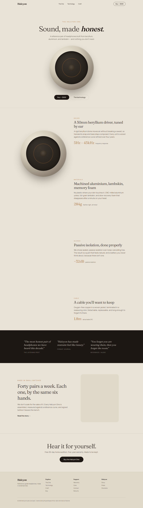

<div align="center">

# Halcyon

**Reference-grade headphones, obsessively made.** A design-forward, **multi-page** luxury
product site, warm, quiet, and editorial, statically rendered with Astro.

[](https://github.com/royalpinto007/halcyon/actions/workflows/ci.yml)
[](LICENSE)


[**Live demo → halcyon.signalizeai.org**](https://halcyon.signalizeai.org)



</div>

## About

A concept site for a fictional luxury headphone. Pages: **home, product, technology, craft,
buy (with finishes), and a 404.** The signature interaction is a **sticky-scroll product
story**, a pinned product visual while the feature copy scrolls alongside, in pure CSS.

## Craft

- **Warm-luxury identity** — ivory ground, espresso ink, a single copper accent, refined
  **Fraunces** serif display paired with **Manrope** (both self-hosted)
- **A CSS-crafted product** — the headphone ear-cup is built from gradients and rings, no image
- **Static-first** — every page ships real HTML; only the nav hydrates. All content is
  **visible without JavaScript** (reveals are progressive enhancement)
- Responsive, accessible, SEO meta + social preview

## Tech

Astro 7 · React 19 (island) · TypeScript · Tailwind CSS v4 · Lenis · Vitest · Cloudflare Pages.

## Run it

```bash
npm install
npm run dev
npm run test
npm run build
```

## License

[MIT](LICENSE) © Royal Simpson Pinto · A concept design, not a real product.
